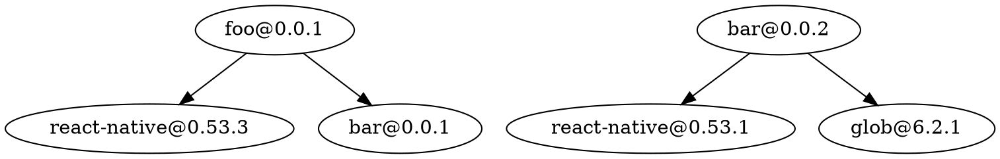
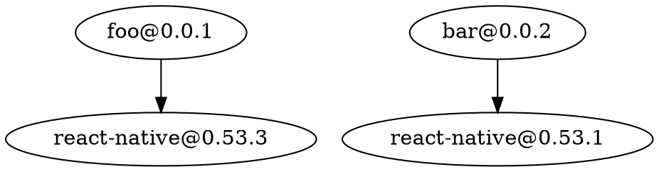
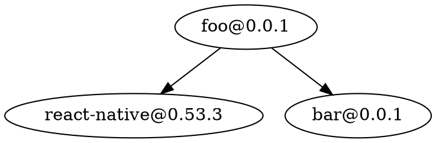

# depend

A tool for syncing version numbers in a monorepo.

# Usage

```
depend -e "packages/*/package.json" [...options]
```

# Options

## --expr, -e "{glob}"

Defines the glob expression that will be used to search the filesystem for
package.json files. By default it will use `"packages/*/package.json"`.

## --fix

Fixes the packages that are not in-sync

## --graph, -g ["{filter}"]

Prints a graphviz compatible output that can be converted to a graphic.

### Examples

Consider following repo:

`packages/foo/package.json`:

```json
{
  "name": "foo",
  "version": "0.0.1",
  "dependencies": {
    "react-native": "0.53.3",
    "bar": "0.0.1"
  }
}
```

`packages/bar/package.json`:

```json
{
  "name": "bar",
  "version": "0.0.2",
  "dependencies": {
    "react-native": "0.53.1",
    "glob": "6.2.1"
  }
}
```

`depend -g` outputs all dependencies in `.dot` format:



`depend -g "*=>react-native"` will only outputs the subset that has react-native
as a dependency:



`depend -g "foo=>*"` will only outputs the subset that has react-native as a
dependency:



### Rendering Svgs

Depend itself does not have any rendering capabilities but `--graph` output can
be directly piped into a [graphviz](https://www.graphviz.org/) renderer.

`depend -g "@times-components/*=>dextrose@" | fdp -Tsvg -o dextrose.svg`


`depend -g "*/ad@ => *" | circo -Tgif -o ad.gif`


## --pick, -p {package}@{version}

Adds `{package}@{version}` to the set of rules. Use this in conjunction with
`--hint` to verify the expected behaviour and use `--fix` to apply the changes.

`depend --pick react-native@0.53.3 --hint` would set all react-native
dependencies to _0.53.3_

### Filter

The filter allows you to restrict the nodes that will be part of the graph.

The graph is described as a set of relationship of the shape `package@version =>
dependency@version`. A Node is included in the graph if the supplied pattern
matches the relationship. Currently only supported placeholder symbol is "\*".

#### Examples

`=>react-native@0.50.*`

everything that installs react-native ver0.50.\*

`=>jest`

everything that installs jest

`@times-components/*=>*`, `@times-components`

all the dependencies of all times-components packages

`*=>*` , ``, `*`

everything

## --bail

exit with code 1 if packages are not in-sync

## strategies [--strategy, -s]

Strategies resolve external dependency version conflicts within the monorepo.
Dependencies that are also packages of the monorepo are always set to the latest
version irrespective of the chosen strategy.

### conservative

pick the oldest used version

### progressive

pick the newest used version

### majority

use the version the is used by the majority of packages in your repo

### majorityConservative

as majority but on a tie pick the older version

### majorityProgressive

as majority but on a tie pick the newer version

## Limitations

Version ranges are currently not supported.
