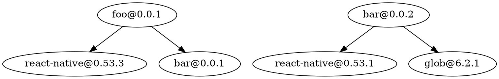
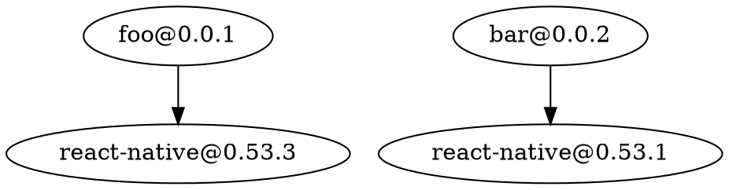
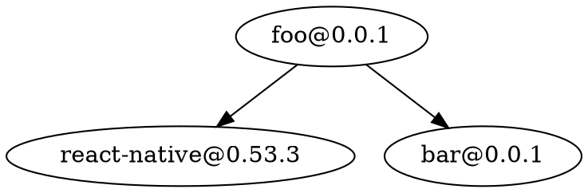

# depend

A tool for analysing, visualizing and syncing version numbers in a monorepo.

This tool parses all `package.json` files described in your `lerna.json` or that
match a given glob-expression. All packages found are assumed to be part of one
monorepo.

# Linting

Based on the parsed packages, linting rules are computed. Based on those rules,
hints are computed and can be displayed using `--hint` and applied with `--fix`.
Strategies add additional rules for ensuring packages install the same external
dependencies. By default, only rules are computed that ensure that every package
installs the latest version of each package found in the monorepo.

# Analysis

`--list` prints all package versions found in the monorepo. Based on the used
rules, packages will be rendered in different colours:

* Green => nothing to do.
* Yellow => rules available to resolve the conflict.
* Red => no rule available to resolve this conflict.

If no rules are available, set a strategy or fix the issue by using `--pick`.

# Usage

```
depend --lerna "{path/to/lerna/project}" [...options]
depend --expr "{glob}" [...options]
```

# Options

## --lerna, -l "{path}"

Evaluate all `package.json` files defined in the `packages` field found
`<path>/lerna.json` file.

## --expr, -e "{glob}"

Defines the glob expression that will be used to search the filesystem for
package.json files.

## --fix

Fixes the packages according to the computed versions.

## --graph, -g ["{filter}"]

Prints a [graphviz](https://graphviz.org) compatible output that can be
converted to an image.

## `--list`

prints all package versions found in the monorepo.

## '--showRules'

prints all computed rules.

### Examples

Consider following repo:

`packages/foo/package.json`:

```json
{
  "name": "foo",
  "version": "0.0.1",
  "dependencies": {
    "react-native": "0.53.3",
    "bar": "0.0.1"
  }
}
```

`packages/bar/package.json`:

```json
{
  "name": "bar",
  "version": "0.0.2",
  "dependencies": {
    "react-native": "0.53.1",
    "glob": "6.2.1"
  }
}
```

`depend -l . -g` outputs all dependencies in `.dot` format:



`depend -l . -g "*=>react-native"` will only outputs the subset that has
react-native as a dependency:



`depend -l . -g "foo=>*"` will only outputs the subset that has react-native as
a dependency:



### Rendering Svgs

Depend itself does not have any rendering capabilities but `--graph` output can
be directly piped into a [graphviz](https://www.graphviz.org/) renderer. `fdp`
and `circo` can be obtained by installing the graphviz package.

`depend -l . -g "@times-components/*=>dextrose@" | fdp -Tsvg -o dextrose.svg`


`depend -l . -g "*/ad@ => *" | circo -Tgif -o ad.gif`


## --pick, -p {package}@{version}

Adds `{package}@{version}` to the set of rules. Use this in conjunction with
`--hint` to verify the expected behaviour and use `--fix` to apply the changes.

`depend -l . --pick react-native@0.53.3 --hint` would set all react-native
dependencies to _0.53.3_

### Filter

The filter allows you to restrict the nodes that will be part of the graph.

The graph is described as a set of relationship of the shape `package@version =>
dependency@version`. A Node is included in the graph if the supplied pattern
matches the relationship. Currently only supported placeholder symbol is "\*".

#### Examples

`=>react-native@0.50.*`

everything that installs react-native ver0.50.\*

`=>jest`

everything that installs jest

`@times-components/*=>*`, `@times-components`

all the dependencies of all times-components packages

`*=>*` , ``, `*`

everything

## --bail

exit with code 1 if packages don't install the expected versions.

## strategies [--strategy, -s]

Strategies compute additional rules how to resolve version conflicts of external
(dev)dependencies within the monorepo.

Dependencies that are also packages of the monorepo, are always (suggested to
be) set to the latest version found in the monorepo irrespective of the chosen
strategy.

### conservative

pick the oldest used version

### progressive

pick the newest used version

### majority

use the version that is used by the majority of packages in your repo

### majorityConservative

as majority but on a tie pick the older version

### majorityProgressive

as majority but on a tie pick the newer version

## Limitations

Strategies `progressive` and `conservative` don't support version ranges.
