# TextFlow



TextFlow is a package for easily doing text heavy layouts on platforms that
don't have a typesetting engine (like React Native). It allows you to flow text
around block elements, measure text sizing without platform support and fit text
into arbitary shapes. It also has markup support for styling such as different
fonts, weights, kerning, tracking and colours.

## Usage

### Measuring Text

```javascript
import { Text as FlowText, Markup } from "@times-components/text-flow";

const text = new FlowText.Text({
  font: "TimesModern-Regular",
  width: 660,
  size: 18,
  lineHeight: 30,
  markup: [new Markup.MarkupString("Hello World!")]
});

const width = text.measuredWidth;
const height = text.measuredHeight;
```

Make sure you set the same font, size and line-height as what you will be
rendering the text with.

### Getting the layout of a paragraph

```javascript
import { Text as FlowText, Layout, Markup } from "@times-components/text-flow";

const textStyle = {
  font: "TimesModern-Regular",
  size: 18,
  lineHeight: 30
};

const flow = new Layout.TextFlow({
  width: 660,
  flow: [
    // First Paragraph
    new FlowText.Text({
      ...textStyle,
      markup: [new Markup.MarkupString("<SOME PARAGRAPH>")]
    }),
    // Second Paragraph
    new FlowText.Text({
      ...textStyle,
      markup: [new Markup.MarkupString("<SOME OTHER PARAGRAPH>")]
    })
  ]
});
```

### Paragraphs with markup

```javascript
import { Text as FlowText, Layout, Markup } from "@times-components/text-flow";

const flow = new FlowText.Text({
  font: "TimesModern-Regular",
  width: 660,
  size: 18,
  lineHeight: 30,
  markup: [
    new Markup.MarkupString("Hello "),
    new Markup.Bold({
      children: [new Markup.MarkupString("Bold ")]
    }),
    new Markup.Italic({
      children: [new Markup.MarkupString("and Italic")]
    }),
    new Markup.Link({
      href: <Text onPress={() => {}}>, Linked world</Text>,
      children: [new Markup.MarkupString(", Linked world")]
    })
  ]
});
```

#### Types of markup supported:

* `Bold`
* `Italic`
* `Link`

No `Markup` API is currently provided for line tracking and character kerning,
default values from the font are used.

##### Adding new Markup:

New markup classes should be put in src/Markup, use `Bold` or `Italic` as an
example. You inherit from `StyledText` and modify the styling in the characters
methods. All `Markup` nodes must implement the `characters()` method that
returns an array of `Character` instances for the typesetter.

### Arbitary text flowing

Currently only flowing around blocks is supported, text exclusion paths are
possible but no API is provided.

```javascript
import { Text as FlowText, Layout, Markup } from "@times-components/text-flow"

const flow = new Layout.TextFlow({
    font: 'TimesModern-Regular',
    width: 660,
    size: 18,
    lineHeight: 30,
    flow: [
        new Layout.InlineBlock({
            width: screenWidth * 0.35,
            height: 300,
            getComponent() {
                return <View>
                    <Image uri={} />
                </View>
            }
        }),
        new FlowText.Text({
            font: 'TimesModern-Regular',
            size: 18,
            lineHeight: 30,
            markup: [
                new Markup.MarkupString("Hello world...")
            ]
        }),
        new Layout.Block({
            width: 660,
            height: 100,
            getComponent() {
                return <View/>
            }
        })
    ]
})
```

The TextFlow class will automatically pull up as much text from the following
paragraphs as it can until it runs out of text or the height of the paragraphs
next to the inline exceeds the height of the dimensions set.

## Rendering

TextFlow does not know how to do any rendering on it's own, it only does layout,
you must implement a bridge to whichever platform you are using for rendering.
An example of such a bridge can be found in `@times-components/article-skeleton`
in `article-skeleton.js` and `article-body-row.js`.

`TextFlow` and `Text` both have a `block` property after layout is done, which
for flow contains the layout classes or an array of `Line` for `Text` in the
`children` property.

Each block or line contains the properties `x`, `y`, `measuredWidth`,
`measuredHeight`, this should be all you need for positioning text in your
rendering. The layout can be refreshed after changing the `markup` or `flow`
properties by calling the `layout` method on either class.

`Line` and `Word` contain a property called `idealSpans`, this will contain
so-called ideal spans which only break when styling changes. For example when
rendering with React Native using these will minimise the number of `<Text/>`
views you need to render.

`Line` and `Word` also have children, with everything containing the layout
properties all the way down to the character level. It is not recommended to
render characters individually but it is possible.

## Contributing

Please read [CONTRIBUTING.md](./CONTRIBUTING.md) before contributing to this
package

## Running the code

Please see our main [README.md](../README.md) to get the project running locally

## Development

The code can be formatted and linted in accordance with the agreed standards.

```
yarn fmt
yarn lint
```

## Testing

Testing can be done on each platform individually

```
yarn test:android
yarn test:ios
yarn test:web
```

Or the tests for all platforms can be run

```
yarn test:all
```

Visit the official

Visit the official
[storybook](http://localhost:9001/?knob-Lead%20Asset=true&knob-Size%20of%20ad%20placeholder%3A=default&knob-Video=true&knob-Headline=true&knob-Section=3&knob-Flags=true&knob-Standfirst=true&knob-Template=indepth&knob-Pull%20Quote=true&knob-Linked%20Byline=true&knob-Label=true&selectedKind=Pages%2FArticle&selectedStory=Article%20with%20template%20choice&full=0&addons=1&stories=1&panelRight=1&addonPanel=storybooks%2Fstorybook-addon-knobs)
to see examples of inline components in articles.

## Future

<!-- Add details of future development here. -->
